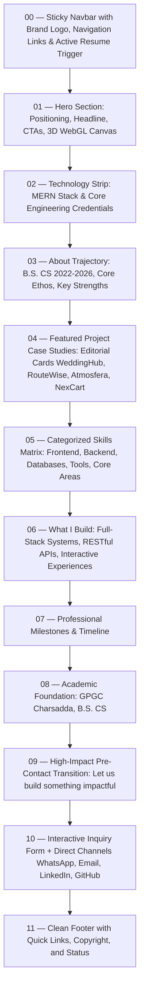

# Muhammad Aqil Khan — UI/UX Design System Specification

**Owner / Principal**: Muhammad Aqil Khan  
**Positioning**: MERN Stack Developer / Full-Stack Web Developer  
**Status**: Stage 3 Approved Specification  
**Design Ethos**: Dark Navy & Deep Blue Foundation, Electric Blue & Cyan Accents, Restrained Depth, Typographic Authority, and Kinetic Clarity.

---

## 1. Visual Direction & Brand Ethos

The visual language reflects an enterprise-grade developer product / modern engineering studio. It avoids generic portfolio clichés (cyberpunk neon overload, hyper-saturated gaming themes, or stark minimalist wireframes). 

### The 70 / 20 / 10 Rule
- **70% Foundation**: Deep Navy (`#030712`, `#070d1e`) absorbing light and providing high-contrast backdrop.
- **20% Layered Surfaces**: Elevated containers (`#0b132b`, `#111c44`) with hairline borders (`#1e293b`) and subtle backdrop blur.
- **10% Kinetic Accents**: Electric Cyan (`#00f2fe`) and Electric Blue (`#4facfe`) drawing eye focus directly to calls-to-action, active indicators, and interactive cues.

---

## 2. Design Tokens System

### A. Semantic Color Palette

| Token Role | Hex Value | CSS Variable / Tailwind | Description & Context |
| :--- | :--- | :--- | :--- |
| **Background Primary** | `#030712` | `--bg-primary` / `bg-navy-950` | Root canvas backdrop, lowest visual elevation |
| **Background Secondary** | `#070d1e` | `--bg-secondary` / `bg-navy-900` | Section-level alternate bands, sidebar canvas |
| **Background Elevated** | `#0b132b` | `--bg-elevated` / `bg-navy-850` | Card bodies, floating dropdowns, popovers |
| **Surface Default** | `rgba(11, 19, 43, 0.7)` | `--surface-default` | Frosted panels with `backdrop-blur-md` |
| **Surface Hover** | `rgba(17, 28, 68, 0.85)`| `--surface-hover` | Interactive cards, hover states for rows |
| **Border Subtly** | `rgba(148, 163, 184, 0.12)`| `--border-subtle` / `border-slate-800` | Hairline separators, non-focused inputs |
| **Border Strong** | `rgba(0, 242, 254, 0.4)` | `--border-strong` / `border-electric-cyan/40` | Focused elements, active project card states |
| **Text Primary** | `#f8fafc` | `--text-primary` / `text-slate-50` | Headlines, primary body copy, titles |
| **Text Secondary** | `#cbd5e1` | `--text-secondary` / `text-slate-300` | Explanatory text, card summaries |
| **Text Muted** | `#64748b` | `--text-muted` / `text-slate-500` | Captions, metadata, inactive links |
| **Accent Primary** | `#00f2fe` | `--accent-primary` / `text-electric-cyan` | Interactive buttons, key emphasis, brand cyan |
| **Accent Secondary** | `#4facfe` | `--accent-secondary` / `text-electric-blue` | Gradient endpoints, secondary indicators |
| **Accent Glow** | `rgba(0, 242, 254, 0.22)`| `--accent-glow` | Dynamic halo drop shadows |
| **State Success** | `#10b981` | `--state-success` / `text-emerald-400` | Published tags, successful submissions |
| **State Warning** | `#f59e0b` | `--state-warning` / `text-amber-400` | Draft badges, pending notifications |
| **State Danger** | `#f43f5e` | `--state-danger` / `text-rose-400` | Destructive actions, validation errors |

---

### B. Typography Hierarchy

- **Display & Headings**: `Space Grotesk` (Google Font) — Technical, sharp geometric personality.
- **Body & Controls**: `Inter` / `Plus Jakarta Sans` — Clean, high-legibility sans-serif.
- **Code & Metadata**: `Fira Code` — Monospaced precision for tech tags, status codes, dates.

| Level | Size (Mobile) | Size (Desktop) | Weight | Line Height | Tracking | Usage |
| :--- | :--- | :--- | :--- | :--- | :--- | :--- |
| **Display** | `2.5rem (40px)` | `4.5rem (72px)` | 800 (ExtraBold) | 1.05 | -0.03em | Hero primary title, statement claims |
| **H1** | `2.0rem (32px)` | `3.25rem (52px)` | 700 (Bold) | 1.15 | -0.025em | Major page headings, case-study titles |
| **H2** | `1.5rem (24px)` | `2.25rem (36px)` | 700 (Bold) | 1.25 | -0.02em | Section titles, card group headings |
| **H3** | `1.25rem (20px)` | `1.5rem (24px)` | 600 (SemiBold) | 1.35 | -0.015em | Project titles, modal headers |
| **H4** | `1.125rem (18px)`| `1.25rem (20px)` | 600 (SemiBold) | 1.4 | 0 | Subsection titles, card group labels |
| **Lead Body** | `1.0rem (16px)` | `1.125rem (18px)`| 400 (Regular) | 1.65 | 0 | Hero subtext, section introductory paras |
| **Body** | `0.875rem (14px)`| `1.0rem (16px)` | 400 (Regular) | 1.6 | 0 | General paragraphs, case-study narrative |
| **Small** | `0.8125rem (13px)`| `0.875rem (14px)`| 500 (Medium) | 1.5 | 0.01em | Table data, form descriptions |
| **Caption / Eyebrow**| `0.6875rem (11px)`| `0.75rem (12px)` | 600 (SemiBold) | 1.4 | 0.12em (Mono)| Category chips, dates, timestamps |
| **Button / Nav** | `0.875rem (14px)`| `0.875rem (14px)`| 600 (SemiBold) | 1.0 | 0.01em | Navigation links, CTAs, action triggers |

---

### C. Spacing Scale

Based on an 8-point harmonic grid:
- `space-1` = `4px` (Micro gaps, badge padding)
- `space-2` = `8px` (Icon to label gap, compact padding)
- `space-3` = `12px` (Standard button vertical padding, form field gaps)
- `space-4` = `16px` (Card inner padding on mobile, standard grid gap)
- `space-6` = `24px` (Desktop card padding, subsection gaps)
- `space-8` = `32px` (Component block spacing)
- `space-12` = `48px` (Section header to content gap)
- `space-16` = `64px` (Standard section vertical padding mobile)
- `space-24` = `96px` (Standard section vertical padding desktop)
- `space-32` = `128px` (Hero vertical padding desktop)

---

### D. Border Radius System

- `radius-sm` = `6px` (Badges, tags, form input controls, small utility buttons)
- `radius-md` = `10px` (Buttons, dropdown popovers, notifications, toasts)
- `radius-lg` = `16px` (Standard cards, media thumbnails, form containers)
- `radius-xl` = `24px` (Featured editorial project cards, hero visual frames)
- `radius-pill` = `9999px` (Eyebrow chips, status pills, circular icon buttons)

---

### E. Shadows & Elevation System

- **Elevation 0 (Flat)**: `box-shadow: none` — Raw background surfaces.
- **Elevation 1 (Subtle)**: `0 1px 3px rgba(0, 0, 0, 0.4), 0 1px 2px rgba(0, 0, 0, 0.3)` — Standard cards.
- **Elevation 2 (Elevated)**: `0 10px 25px -5px rgba(0, 0, 0, 0.6), 0 8px 10px -6px rgba(0, 0, 0, 0.5)` — Dropdowns, hovered cards.
- **Elevation 3 (Floating)**: `0 20px 35px -10px rgba(0, 0, 0, 0.75)` — Modals, fixed overlays.
- **Accent Glow**: `0 0 25px rgba(0, 242, 254, 0.22)` — Primary CTA buttons and key active project visual accents.

---

## 3. Component Language & Interaction Rules

### A. Button Hierarchy
1. **Primary CTA (`View My Work`, `Submit Message`)**:
   - Background: Gradient `from-electric-cyan to-electric-blue`, text `navy-950` bold.
   - Glow: `shadow-glow-cyan`.
   - Hover: Transform `translateY(-2px)`, glow expansion, brightness boost.
   - Focus: Ring 2px `electric-cyan` with 2px offset.
2. **Secondary (`Get in Touch`, `Explore Details`)**:
   - Background: `navy-850`, border `1px solid rgba(148, 163, 184, 0.2)`.
   - Hover: Border color transitions to `electric-cyan/60`, background to `navy-800`.
3. **Ghost / Outline (`Download Resume`, `Filter Tags`)**:
   - Border: `1px solid rgba(0, 242, 254, 0.4)`, text `electric-cyan`.
   - Hover: Background `rgba(0, 242, 254, 0.08)`.
4. **Icon Action (`ExternalLink`, `Copy`, `Delete`)**:
   - Minimalist 36x36px / 40x40px square pill with center-aligned Lucide icon.

### B. Interactive Card System
- Standard container with `bg-navy-900/80 backdrop-blur-md border border-slate-800`.
- Hover behavior: Hairline border shifts to `rgba(0, 242, 254, 0.3)`, card elevates by `-4px`, thumbnail image smoothly scales `1.03` inside overflow-hidden bounds.

### C. Form Controls
- Inputs & Textareas: Background `bg-navy-950/80`, border `1px solid rgba(148, 163, 184, 0.15)`, text `slate-100`.
- Active / Focus: Border changes to `electric-cyan`, outer ring `rgba(0, 242, 254, 0.15)`.
- Error state: Border transitions to `rose-500`, supporting helper text in `rose-400` with icon indicator.

---

## 4. Public Page Blueprint & Content Flow



### Detailed Section Blueprints

#### 01. Hero Section
- **Left Column (58% Desktop)**:
  - Eyebrow tag: `[AVAILABLE FOR HIGH-IMPACT ROLES]` with pulsing emerald status dot.
  - Display Title: *"Muhammad Aqil Khan"* in high-contrast crisp Space Grotesk.
  - Sub-headline: *"MERN Stack Developer / Full-Stack Web Developer"*.
  - Elevator Pitch: *"Architecting responsive web applications, secure RESTful micro-architectures, and high-performance user interfaces."*
  - Action Group: Primary button *"View My Work"*, secondary button *"Get in Touch"*, and quick links for GitHub / LinkedIn.
- **Right Column (42% Desktop)**:
  - 3D interactive viewport holding abstract geometric MERN cluster (Three.js / R3F) floating over deep-navy ambient gradient glow.
  - Fallback: Crisp SVG architecture schematic for weak GPUs / mobile devices.

#### 02. Technology & Trust Strip
- Continuous horizontal ribbon displaying core competencies: `React.js` • `Node.js` • `Express.js` • `MongoDB` • `TypeScript` • `Tailwind CSS` • `GSAP` • `Three.js` • `Git`.
- Clean monochrome styling with subtle hover glow.

#### 03. About Trajectory
- Narrative breakdown focusing on technical curiosity, problem-solving, and systematic software construction.
- Key facts card: Location (`Charsadda, Pakistan`), Degree (`B.S. Computer Science 2022–2026`), Primary Competencies (`MERN Stack & Full-Stack Development`).

#### 04. Featured Projects (Case Study Editorial Format)
- Large visual layout alternating between Left-Image/Right-Info and Right-Image/Left-Info:
  - Indexing: `01 / 04`, `02 / 04` in monospaced cyan typography.
  - Project Title & Category Pill (e.g., *"WeddingHub — Multi-Vendor Marketplace"*).
  - Short summary outlining the problem solved and technical implementation.
  - Tech badges: Pill tags for used frameworks and libraries.
  - Dual action links: *"Live Demo"* (with external icon) and *"Source Code"* (GitHub).

#### 05. Categorized Skills Section
- Tabbed or multi-column segmented cards matching verified skill sets:
  1. **Frontend Development**: React, JavaScript (ES2023), TypeScript, Tailwind CSS, Modern UI/UX, GSAP, Three.js, HTML5/CSS3.
  2. **Backend Development**: Node.js, Express.js, REST API Development, CRUD Architectures.
  3. **Databases & Services**: MongoDB, MySQL, Firebase Firestore, Firebase Auth, Firebase Storage.
  4. **Development Tools**: Git, GitHub, VS Code, Vite.
  5. **Core Development Areas**: MERN Stack Development, Full-Stack Architecture, API Integration, RBAC Authentication, Database-Driven Systems.

#### 06. What I Build / Services
- Six structured value cards:
  - *Full-Stack Web Applications*
  - *MERN Architecture Systems*
  - *Custom RESTful APIs & Microservices*
  - *Modern Interactive UI/UX*
  - *Database Modeling & Optimization*
  - *Authentication & Role-Based Access Control*

#### 07. Experience & Timeline
- Chronological timeline featuring milestone cards with dates, roles, deliverables, and tech tags.

#### 08. Education Section
- B.S. Computer Science (2022 – 2026).
- Core academic emphasis: Software engineering principles, database systems, data structures, algorithms, and web application architecture.

#### 09. High-Impact CTA Strip
- Dark-blue glowing surface with prominent typography: *"Have a Project in Mind or an Engineering Opportunity?"*
- Immediate jump button triggering smooth scroll to `#contact`.

#### 10. Contact Section
- Dual-column layout:
  - Left: Verified direct communication channels (WhatsApp click-to-chat, direct email, location coordinates, LinkedIn).
  - Right: Validated message form (`Name`, `Email`, `Message` body) protected by rate limiting and real-time validation feedback.

---

## 5. Admin CMS Dashboard Blueprint

The Admin CMS operates with a clean, high-density SaaS interface designed for speed, clarity, and zero cognitive overhead.

```text
┌────────────────────────────────────────────────────────────────────────┐
│ Header: [Portfolio CMS] • Role: super_admin • Status: Connected        │
├─────────────────┬──────────────────────────────────────────────────────┤
│ SIDEBAR         │ MAIN CONTENT WORKSPACE                               │
│ • Dashboard     │ ┌──────────────────────────────────────────────────┐ │
│ • Profile       │ │ Metrics Row: Total Projects | Published | Inquiries│ │
│ • Projects      │ ├──────────────────────────────────────────────────┤ │
│ • Skills        │ │ Active Workspace Table / Form / Gallery View     │ │
│ • Experience    │ │                                                  │ │
│ • Education     │ │ [Search & Filters]        [+ Add New Resource]   │ │
│ • CV / Resume   │ │ ──────────────────────────────────────────────── │ │
│ • Media Library │ │ Tabular Data with Sort, Edit, Publish, Delete    │ │
│ • Messages      │ └──────────────────────────────────────────────────┘ │
│ • Settings      │                                                      │
│ ────────────────│                                                      │
│ [Live Site ↗]   │                                                      │
│ [Sign Out]      │                                                      │
└─────────────────┴──────────────────────────────────────────────────────┘
```

### CMS Workspaces Specifications
1. **Projects Manager**:
   - Tabular view with columns: Thumbnail, Title, Category, Published Status (Toggle Switch), Order Index, Actions (Edit, Delete).
   - Project Editor: Multi-tab layout (General Info, Tech Stack, Gallery Upload, Markdown Description, External URLs).
2. **CV & Document Manager**:
   - Dedicated Active CV Card showing file name, version number, upload date, and active indicator.
   - One-click file replacement zone with immediate validation (PDF only, max 5MB).
3. **Media Asset Library**:
   - Visual masonry grid of uploaded graphics with direct "Copy URL" shortcuts, dimensions display, and deletion triggers.
4. **Messages Inbox**:
   - Split-pane inbox: Left pane lists incoming inquiries with unread status dots; right pane displays sender info, email link, timestamp, and full inquiry text.

---

## 6. Responsive Rules & Breakpoints

| Breakpoint | Target Devices | Navigation Mode | Grid Columns | 3D Graphics Mode |
| :--- | :--- | :--- | :--- | :--- |
| **Mobile (`<640px`)** | iPhones, Android devices | Fullscreen animated modal overlay | 1 column stacked | Static lightweight vector fallback (0 WebGL drawcalls) |
| **Tablet (`640px - 1024px`)** | iPads, Tablets, Foldables | Compact navbar with hamburger trigger | 2 columns adaptive | Low-poly simplified geometry with reduced DPR (1.0) |
| **Desktop (`1024px - 1440px`)**| Laptops, Workstations | Expanded horizontal navbar with CTAs | 12-column editorial grid | Full Three.js canvas with subtle interactive pointer tracking |
| **Ultra-Wide (`>1440px`)** | 2K / 4K Monitors | Max-width container (`1280px`) centered | 12-column wide grid | Framerate-capped WebGL with ambient particle drift |

---

## 7. Animation Principles (GSAP, ScrollTrigger, Lenis & Three.js)

1. **Hierarchy Before Motion**: Animations exist to reveal information hierarchy, not to show off library features.
2. **Restrained Easing**: Use `power3.out` or `expo.out` for crisp, high-end entries; avoid springy, cartoony bounces (`elastic` or `bounce`).
3. **Timing Budget**:
   - Micro-interactions (hover, active): `150ms – 250ms`.
   - Element reveals & staggers: `500ms – 800ms` with `0.08s` stagger intervals.
   - Page transitions: Maximum `400ms` exit, `500ms` enter.
4. **ScrollTrigger Pinning Rule**: Pinning is reserved strictly for high-impact project showcases; never pin normal text paragraphs or create scroll traps.
5. **Accessibility Enforcement**: Wrap all GSAP timelines in `prefers-reduced-motion` conditionals. If active, elements immediately render in their final visible state (`opacity: 1, transform: none`).
